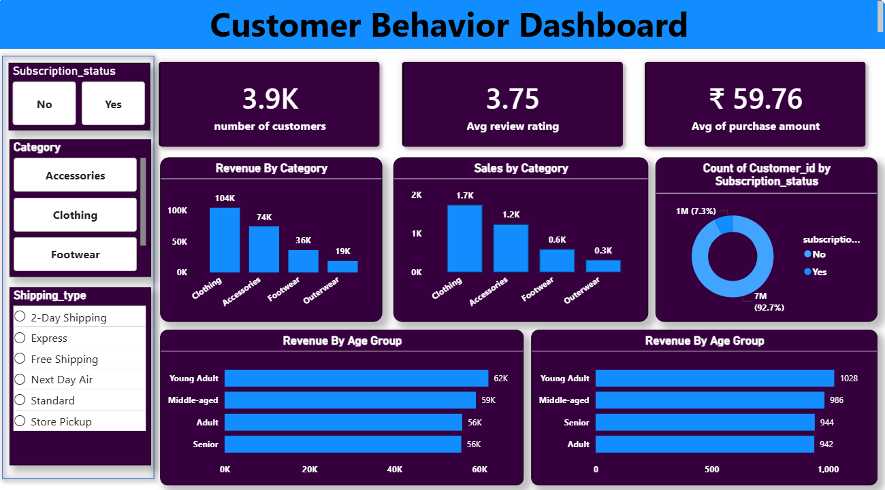

# Customer Shopping Behavior Analysis

## Project Title
Customer Shopping Behavior Analysis using Python, SQL & Power BI

## Brief Summary
Analyzed 3,900 customer transactions to identify spending patterns, customer segmentation, subscription behavior, and product performance using Python, PostgreSQL, and Power BI.

## Overview
This end-to-end analytics project includes:
- Data cleaning and preprocessing in Python
- Business analysis using PostgreSQL
- Interactive dashboard development in Power BI

## Problem Statement
Businesses collect large volumes of customer transaction data but often struggle to generate actionable insights.

This project helps answer:
- Which customers generate the highest revenue?
- How do discounts impact spending behavior?
- Are subscribers more valuable than non-subscribers?
- Which products perform best across categories?

## Dataset
- Rows: 3,900
- Columns: 18

Key features:
- Customer demographics
- Purchase behavior
- Subscription status
- Product categories
- Shipping type
- Review ratings

## Tools & Technologies
- Python (Pandas, NumPy)
- PostgreSQL
- SQLAlchemy
- Power BI
- Git & GitHub

## Methods
### Python
- Data cleaning
- Missing value handling
- Feature engineering
- Column standardization

### SQL
- Revenue analysis
- Customer segmentation
- Product analysis
- Subscription analysis

### Power BI
Created an interactive dashboard for KPI tracking and business insights.

## Dashboard Preview


## Key Insights
- Subscribers spend more on average
- Clothing generates highest revenue
- Young adults are highest revenue contributors
- Express and faster shipping users spend more

## How to Run
1. Install dependencies
```bash
pip install pandas sqlalchemy psycopg2
```

2. Run Python script
```bash
python shopping_analysis.py
```

3. Open Power BI dashboard file

## Results & Conclusion
This project demonstrates an end-to-end analytics workflow from raw data cleaning to dashboard reporting for business decision-making.

## Future Work
- Customer churn prediction
- Recommendation system
- Customer lifetime value analysis

## Author
**Shushree Pranati Swain**

- GitHub: https://github.com/yourusername
- LinkedIn: https://linkedin.com/in/yourprofile
